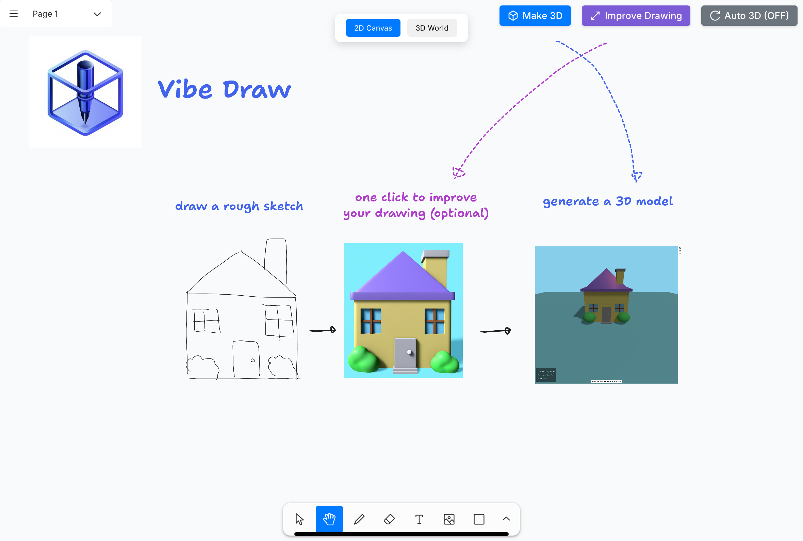

# Scribble3D

Turn sketches into 3D models and compose interactive worlds in the browser.

Scribble3D is based on [Vibe Draw](https://github.com/martin226/vibe-draw). This version uses a Next.js frontend and a FastAPI backend.



## Features

- Draw and annotate sketches with TLDraw.
- Enhance drawings with Gemini image generation.
- Generate Three.js scene code through Anthropic or model assets through Trellis via PiAPI.
- Edit generated code previews using sketch and text instructions.
- Extract reusable object code with Cerebras and add objects to a shared 3D world.
- Select, translate, rotate, and scale objects.
- Navigate with first-person keyboard controls or touch joysticks.
- Export user-created scene content as a JSON glTF file.

The drawing canvas has browser persistence configured. The assembled world currently depends on in-memory state and is not a durable saved project.

## Technology

| Area | Stack |
|---|---|
| Frontend | Next.js 14, React 18, TypeScript, TLDraw |
| 3D editor | Three.js, React Three Fiber, Drei, Zustand |
| API | Python, FastAPI, Pydantic, HTTPX |
| Background processing | Celery and Redis |
| Task updates | Server-Sent Events and WebSockets |
| AI integrations | Anthropic, Google Gemini, Cerebras, PiAPI Trellis |

## Run locally

Use separate terminals for the frontend and backend. You need Node.js and npm, Docker, Docker Compose, and credentials for the AI features you use.

### Frontend

```bash
cd frontend
npm ci
npm run dev
```

Open the development URL printed by Next.js, normally http://localhost:3000.

### Backend

```bash
cd backend
cp .env.example .env
```

Copy the example only if you do not already have a configured .env. Fill in the keys for the workflows you want to use:

| Environment variable | Operation |
|---|---|
| ANTHROPIC_API_KEY | Code generation and editing |
| GOOGLE_API_KEY | Drawing enhancement |
| CEREBRAS_API_KEY | Add a code preview to the world |
| TRELLIS_API_KEY | Mesh generation through PiAPI |

Then start the API, worker, and Redis services:

```bash
docker compose config --quiet
docker compose up --build -d
docker compose ps
```

The API listens at http://localhost:8000, with API documentation at http://localhost:8000/docs. The backend image uses Python 3.11.

The source contains legacy provider model IDs. Verify current model availability and request/response compatibility before testing live generation. OpenRouter is not integrated in this version.

### Basic checks

From the backend directory:

```bash
docker compose exec -T redis redis-cli ping
curl -fsS http://localhost:8000/
docker compose exec -T worker celery -A worker inspect --timeout=10 ping
```

These check service connectivity, not successful AI generation.

## Generation paths

The main Make 3D button starts with its thinking toggle enabled, selecting Trellis mesh generation. Disable that toggle for the Anthropic code-generation path. The toggle selects an output pipeline; it does not enable a language model's reasoning mode.

Queued code-generation, editing, and enhancement tasks use Celery with Redis and return lifecycle events over SSE. Trellis tasks run at PiAPI; the backend polls status and relays it through a WebSocket. Cerebras object extraction is a direct awaited API call.

Generated JavaScript is executed in the browser. Public deployment requires a deliberate output-execution policy, authenticated ownership, and request/budget limits.

## Source layout

- frontend: sketch editor, previews, world editor, and glTF export.
- backend: API contracts, task orchestration, provider integrations, and local Compose services.
- docs: product screenshots and icon assets.

## License and attribution

The application source is based on [Vibe Draw by martin226](https://github.com/martin226/vibe-draw). The original [GNU Affero General Public License v3](LICENSE) is retained.
